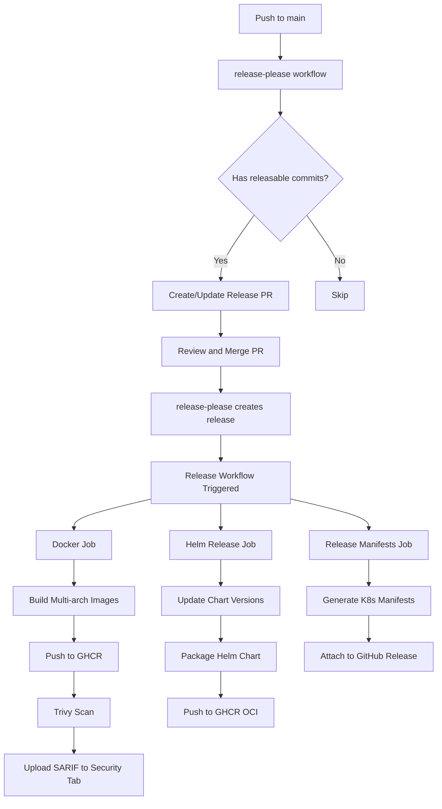

# Release Process

This document describes the automated release process for the Database User Operator.

## Overview

The release process is fully automated using [release-please](https://github.com/googleapis/release-please) and GitHub Actions. The workflow is:

1. **Conventional Commits** - Use conventional commit format (feat:, fix:, etc.) for all changes
2. **Automatic Release PR** - release-please creates/updates a release PR with changelog and version bumps
3. **Merge Release PR** - When merged, release-please creates a GitHub release and tag automatically
4. **Build and Publish** - Docker images, Helm charts, and manifests are built and published

**Key benefits:**
- No manual version bumping required
- Automatic changelog generation from commits
- Semantic versioning based on commit types
- Single source of truth in conventional commits

## Creating a Release

### 1. Use Conventional Commits

All commits to `main` should follow the [Conventional Commits](https://www.conventionalcommits.org/) format:

```bash
# Feature (bumps minor version)
git commit -m "feat: add support for custom privileges"

# Bug fix (bumps patch version)
git commit -m "fix: resolve connection timeout issue"

# Breaking change (bumps major version)
git commit -m "feat!: remove deprecated config field"
# or
git commit -m "feat: new API structure

BREAKING CHANGE: The old API structure is no longer supported"

# Other types (no version bump)
git commit -m "docs: update README"
git commit -m "chore: update dependencies"
git commit -m "test: add integration tests"
```

### 2. Wait for Release PR

After changes are merged to `main`, release-please automatically:

1. Scans commits since the last release
2. Determines the next version based on conventional commits
3. Creates or updates a release PR with:
   - Updated version in all relevant files
   - Generated CHANGELOG.md with all changes
   - Git tag information

The PR title will be: `chore(main): release X.Y.Z`

### 3. Review and Merge Release PR

Review the automatically generated:
- Version bump (appropriate for the changes?)
- CHANGELOG.md (captures all important changes?)
- File updates (Chart.yaml, values.yaml, etc.)

If everything looks good, **approve and merge the PR**.

### 4. Automatic Release Creation

When the release PR is merged, release-please automatically:
- Creates a GitHub release
- Creates a git tag (e.g., `v0.1.0`)
- Publishes the release

### 5. Automated Build and Publish

The release triggers the release workflow which automatically:
- Builds and pushes multi-arch Docker images to `ghcr.io/opzkit/database-user-operator`
- Scans images with Trivy and uploads results to GitHub Security
- Packages and pushes Helm chart to `oci://ghcr.io/opzkit/charts/database-user-operator`
- Generates and attaches Kubernetes manifests to the release

Monitor progress at: `https://github.com/opzkit/database-user-operator/actions`

## Release Artifacts

### Docker Images

Images are published to GitHub Container Registry with multiple tags:

```bash
# Pull specific version
docker pull ghcr.io/opzkit/database-user-operator:v0.1.0

# Pull by major.minor
docker pull ghcr.io/opzkit/database-user-operator:0.1

# Pull by major version
docker pull ghcr.io/opzkit/database-user-operator:0

# Pull by commit SHA
docker pull ghcr.io/opzkit/database-user-operator:sha-abc1234
```

**Supported Platforms:**
- `linux/amd64`
- `linux/arm64`

### Helm Charts

Charts are published to GHCR as OCI artifacts:

```bash
# Install from OCI registry
helm install database-user-operator \
  oci://ghcr.io/opzkit/charts/database-user-operator \
  --version 0.1.0 \
  --namespace db-system \
  --create-namespace

# Pull and inspect the chart
helm pull oci://ghcr.io/opzkit/charts/database-user-operator --version 0.1.0
```

### Kubernetes Manifests

A complete installation manifest is attached as `database-user-operator.yaml`:

```bash
# Install via manifest
kubectl apply -f https://github.com/opzkit/database-user-operator/releases/download/v0.1.0/database-user-operator.yaml
```

## Security Scanning

All released images are automatically scanned with Trivy for:

- OS vulnerabilities
- Application dependencies vulnerabilities
- Misconfigurations

Results are available in:
- GitHub Security tab: `Security` → `Code scanning`
- Workflow logs: Check the "Run Trivy" step output

**Release Policy:**
- ⚠️ Releases with CRITICAL vulnerabilities are flagged in workflow output
- 📊 All vulnerability reports are uploaded to GitHub Security tab
- 🔍 Review security issues before promoting to production

## Version Numbering

We follow [Semantic Versioning](https://semver.org/):

- `MAJOR.MINOR.PATCH` (e.g., `1.2.3`)
- `MAJOR`: Breaking changes
- `MINOR`: New features (backwards compatible)
- `PATCH`: Bug fixes (backwards compatible)

**Pre-releases:**
- Use suffixes: `v1.0.0-rc.1`, `v1.0.0-beta.1`, `v1.0.0-alpha.1`
- These are automatically marked as pre-releases in GitHub

## Rollback

If you need to rollback a release:

### Option 1: Create a Patch Release (Recommended)

Fix the issue and create a new release:

```bash
# Fix the issue in a branch
git checkout -b fix/critical-issue
# Make your fixes...
git commit -m "fix: resolve critical issue"
git push origin fix/critical-issue

# Merge the fix PR to main
# release-please will automatically create a patch release (v0.1.1)
```

### Option 2: Delete the Release (Before Production Deployment)

Only do this if the release hasn't been deployed to production:

```bash
# Delete the GitHub Release in the UI
# Then delete the tag
git push origin :refs/tags/v0.1.0
git tag -d v0.1.0
```

**Note:** After deleting a release, you may need to manually update release-please state or create a new release PR.

## Troubleshooting

### No Release PR Created

If release-please doesn't create a PR after merging to `main`:

1. **Check commits are conventional**: Only `feat:` and `fix:` trigger releases
2. **Check previous release exists**: First release may need manual bootstrapping
3. **Check workflow logs**: Look for errors in release-please workflow
4. **Verify branch name**: Must be `main` (or configured branch)

### Release Workflow Failed

1. Check the workflow logs in GitHub Actions
2. Common issues:
   - **Docker build fails**: Check `Dockerfile` and build context
   - **Helm push fails**: Verify GITHUB_TOKEN has `packages: write` permission
   - **Trivy scan fails**: Usually informational, check severity thresholds
   - **Manifest generation fails**: Ensure CRDs are valid

### Image Not Appearing in GHCR

1. Verify the workflow completed successfully
2. Check that GITHUB_TOKEN has `packages: write` permission
3. Ensure the repository's package settings allow the image
4. Visit: `https://github.com/orgs/opzkit/packages`

### Helm Chart Not Found

1. Verify the `helm-release` job completed successfully
2. Check Helm chart is in: `https://github.com/opzkit?tab=packages`
3. Try pulling with full path:
   ```bash
   helm pull oci://ghcr.io/opzkit/charts/database-user-operator --version 0.1.0
   ```

### Security Scanning Errors

Trivy errors are usually non-blocking. Common issues:

- **Rate limiting**: Trivy database updates may hit rate limits. Retry.
- **Network timeouts**: Transient network issues. Retry the workflow.
- **Scan took too long**: Increase timeout in workflow if needed.

## Manual Release (Emergency)

If the automated release workflow fails, you can manually trigger parts of it:

### 1. Manually Trigger Release Creation

If release-please fails to create a release after merging:

```bash
# Create a tag manually
git tag v0.1.0
git push origin v0.1.0

# Create GitHub release manually via CLI
gh release create v0.1.0 \
  --title "v0.1.0" \
  --notes "See CHANGELOG.md for details"
```

This will trigger the release workflow to build and publish artifacts.

### 2. Manually Build and Push Artifacts (Last Resort)

Only if the workflow completely fails:

```bash
# Build and push Docker image
docker buildx build --platform linux/amd64,linux/arm64 \
  -t ghcr.io/opzkit/database-user-operator:v0.1.0 \
  --push .

# Package and push Helm chart
sed -i "s/^version:.*/version: 0.1.0/" helm/database-user-operator/Chart.yaml
sed -i "s/^appVersion:.*/appVersion: \"0.1.0\"/" helm/database-user-operator/Chart.yaml
helm package helm/database-user-operator
helm push database-user-operator-0.1.0.tgz oci://ghcr.io/opzkit/charts
```

## CI/CD Architecture



## Best Practices

1. **Use Conventional Commits**: Always use the correct commit format - this drives the entire release process
2. **Test Before Merging**: All PRs should pass tests before merging to `main`
3. **Review Release PRs Carefully**: Check the generated changelog and version bump
4. **Monitor Security Scans**: Review Trivy scan results in the workflow logs
5. **Keep Dependencies Updated**: Regularly update Go modules and dependencies
6. **Communicate Releases**: Announce releases in relevant channels with links to changelog

## Automated Workflows

### On Push to main

| Workflow | Purpose | Outputs |
|----------|---------|---------|
| **release-please** | Manage releases | Release PR with changelog and version bumps |
| **lint** | Code quality checks | - |
| **test** | Unit tests | - |
| **build** | Build binary and Docker image | - |
| **integration-test** | Integration tests | Coverage reports |
| **verify-manifests** | Ensure generated files are up to date | - |

### On Release Published

| Workflow | Purpose | Outputs |
|----------|---------|---------|
| **docker** | Build & push images | Multi-arch images in GHCR |
| **helm-release** | Package & publish chart | Helm chart in GHCR OCI |
| **release-manifests** | Generate K8s manifests | Installation YAML attached to release |

### On Pull Request

| Workflow | Purpose |
|----------|---------|
| **lint** | Code quality checks |
| **test** | Unit tests |
| **build** | Build verification |
| **verify-manifests** | Check generated files |

## Security & Compliance

### Image Scanning

All images are scanned with Trivy for:
- CVE vulnerabilities (OS packages)
- Application dependency vulnerabilities
- Kubernetes security issues
- Sensitive information

Results are uploaded to GitHub Security tab (Code Scanning).

### SBOM Generation

(Coming soon) Software Bill of Materials will be generated and attached to releases.

### Image Signing

(Coming soon) Images will be signed with Cosign/Sigstore for supply chain security.

## References

- [release-please](https://github.com/googleapis/release-please) - Automated releases powered by conventional commits
- [Conventional Commits](https://www.conventionalcommits.org/) - Specification for commit message format
- [Semantic Versioning](https://semver.org/) - Version numbering scheme
- [Helm OCI Support](https://helm.sh/docs/topics/registries/) - Publishing charts to OCI registries
- [Trivy Documentation](https://aquasecurity.github.io/trivy/) - Container vulnerability scanning
- [GitHub Actions](https://docs.github.com/en/actions) - CI/CD automation
